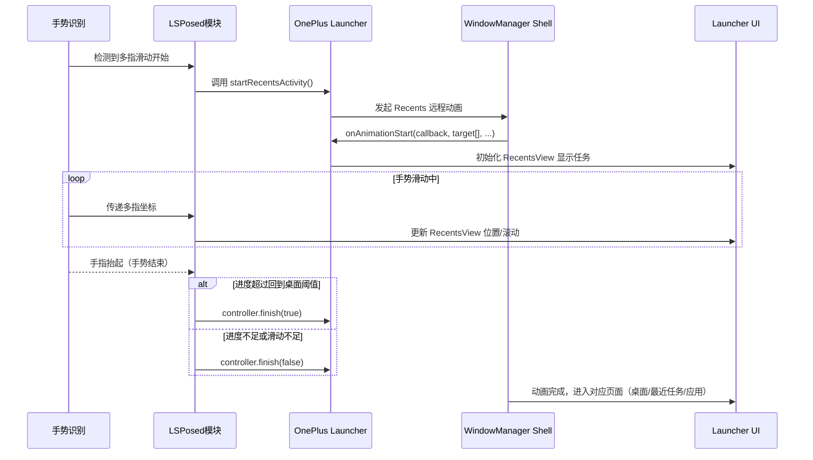

# 执行摘要  
基于 Android 16 的 OnePlus Launcher，实现多指手势触发 Recents/Home 切换的动画完全可行。方案包括：**复用 Launcher 自带动画**（通过 Quickstep 处理多指手势）、**使用系统 RemoteAnimation**（调用 `startRecentsActivity` 并实现 `IRecentsAnimationRunner` 控制动画）和**模拟 TaskView 动画**（利用 Launcher3 的 TaskView 模拟类）。本文深入分析了三种方案的技术细节，比较了优缺点，并推荐了最佳方案。具体包括所需系统接口（如 `RecentsAnimationControllerCompat`、`ActivityManagerWrapper`、`RecentsAnimationTargets`）、注入点与 Hook 列表（如拦截多指触摸事件、启动 Recents 动画、监听 `RecentsAnimationListener` 回调等）、关键数据流与时序（下图），动画进度/位置控制方法和代码示例、阈值与速度判定策略、动画插值方案，以及与 Launcher 原生动画衔接的细节。最后给出了性能兼容性注意点及测试/调试方法。  

```mermaid
sequenceDiagram
    participant User as 多指手势
    participant Module as LSPosed 模块
    participant Launcher as Launcher（Quickstep）
    participant WM as WindowManagerService
    participant RecentsVC as RecentsView

    User->>Module: 多指上滑触发手势事件
    Module->>Launcher: 通知手势开始
    Launcher->>WM: startRecentsActivity（传递 IRecentsAnimationRunner）
    WM->>Launcher: onAnimationStart（传入 RecentsAnimationControllerCompat, RemoteAnimationTarget）
    Note right of Launcher: 初始化 RecentsView，显示任务  
    User->>Launcher: 手指继续滑动（多指中心点移动）
    Launcher->>RecentsVC: 根据手势进度滚动 Recents 视图
    RecentsVC->>User: Recents 界面随手势移动  
    User-->>Module: 手势松开（手势结束）
    Module->>Launcher: 判断位移和速度，决定动作  
    alt 回到主屏幕（GoHome）
        Launcher->>RecentsAnimationController: finish(true)  # toRecents=false
        RecentsAnimationController->>WM: finish(toHome)
        WM->>Launcher: 向主屏幕切换动画完成
    else 打开任务视图（Overview）
        Launcher->>RecentsAnimationController: finish(false) # toRecents=true
        RecentsAnimationController->>WM: finish(toRecents)
        WM->>RecentsVC: 任务概览动画完成
    else 切换上一个/下一个应用
        Launcher->>RecentsAnimationController: finish(false)
        Launcher调用QuickSwitch逻辑或直接启动前一个/下一个任务Activity
        WM->>Launcher: 快速切换动画完成或新任务启动
    end
```

## 可行性评估  
- **复用 Launcher 动画**：OnePlus Launcher 基于 AOSP Quickstep，原生已实现单指上滑唤起 Recents 的动画逻辑（`AbsSwipeUpHandler` 和 `RecentsAnimationController` 等）。若能 Hook 多指手势，将其注入到 Quickstep 的处理流程中，可复用其动画。优点是动画自然流畅；缺点是 Quickstep 代码复杂，且原生只支持单指，需要自定义注入点并处理多指中心点移动。兼容性好（使用系统原生逻辑），但实现难度较高。  
- **使用 RemoteAnimation**：直接调用系统提供的远程动画接口，通过 `ActivityManagerWrapper.startRecentsActivity()` 启动 Recents 动画，再用自定义 `IRecentsAnimationRunner` 控制动画进度。优点是不依赖 Launcher 代码，可跨第三方 Launcher 工作，使用系统公开接口。缺点是需自行管理动画进度、任务缩放、背景壁纸等，开发复杂度高。若处理得当，效果可与系统动画一致。  
- **模拟 TaskView 动画**：利用 Launcher3 中的 `TaskViewSimulator` 等工具类，在自己实现的 UI 中手动模拟任务缩放、滑动等动画。优点是灵活度高，可以完全自定义视觉效果；缺点是需要编写大量动画逻辑（例如模拟任务位置和剪裁矩形），易出错且耗时。通常不推荐用于简单手势交互。  

综上，RemoteAnimation 与复用 Quickstep 动画可行性最高。推荐使用 **RemoteAnimation** 方案：通过系统动画接口来驱动任务窗口移动，可达到与系统动画统一的效果，同时不依赖 Launcher 内部私有 API。在必要时，可用 Quickstep 的 `RecentsAnimationControllerCompat` 等类简化控制。

## 所需系统/权限/接口  
- **系统权限**：触发 RecentsActivity 需要 `android.permission.REORDER_TASKS` 或系统签名权限（Launcher 已拥有）。使用 RemoteAnimation 需能调用 `ActivityTaskManager.getService().startRecentsActivity()`。  
- **主要接口**：  
  - `ActivityManagerWrapper` / `SystemUiProxy`：用于启动 Recents，例如调用 `startRecentsActivity(Intent, ..., RecentsAnimationListener, ...)`。  
  - `IRecentsAnimationRunner` 接口：实现 `onAnimationStart(IRecentsAnimationController, RemoteAnimationTarget[]..., Rect, Rect)`，获取 `RecentsAnimationControllerCompat` 和 `RemoteAnimationTarget`。  
  - **RecentsAnimationControllerCompat**（系统UI 库）和 **RecentsAnimationController**（Launcher3 封装）：用于控制动画，例如 `setUseLauncherSystemBarFlags()`、`setWillFinishToHome()`、`finish()` 等。  
  - **RecentsAnimationTargets**：封装了应用窗口和壁纸的 `RemoteAnimationTarget` 数组，以及 `homeContentInsets`、`minimizedHomeBounds` 等额外信息。  
  - **RecentsView、TaskView**：Launcher3 中显示任务缩略图的视图，用于直接滚动视图或获取当前中心任务。可通过 Hook 设置 `mRecentsView.setRecentsAnimationTargets(targets, callbacks)`，与 RemoteAnimation 结果绑定。  
  - **TaskViewSimulator**：Quickstep 提供的工具类，用于计算任务窗口变换参数（平移/缩放）。可在需要时借鉴，用于精确定位任务 Leash。在直接使用系统 RemoteAnimation 时，通常不需要手动调用。  

## 注入点与 Hook 点  
在 LSPosed 模块中，可以通过以下关键点注入或 Hook：  
- **多指手势监听**：Hook OnePlus Launcher 捕捉到多指滑动事件的方法（如自定义 `onTouchEvent` 或 GestureDetector）。当识别到多指滑动后，调用下面的 Recents 相关逻辑。  
- **启动 Recents 动画**：在多指手势开始时，通过反射或接口调用 `ActivityManagerWrapper.startRecentsActivity()` 或 `SystemUiProxy.startRecentsActivity()`，并传入自定义的 `RecentsAnimationListener`。  
- **RecentsAnimationListener 回调**：实现 `onAnimationStart(controller, apps, walls, homeInsets, miniBounds)` 等，保存返回的 `RecentsAnimationControllerCompat`（可包装为 RecentsAnimationController）和 `RemoteAnimationTarget`。在回调中，可设置当前 `RecentsView` 的目标 leashes。例如：
  ```java
  controllerCompat = new RecentsAnimationControllerCompat(controllerBinder);
  targetsCompat = RemoteAnimationTargetCompat.wrap(apps, walls);
  // 绑定给 RecentsView
  recentsView.setRecentsAnimationTargets(
      new RemoteAnimationTargets(targetsCompat, null, homeInsets, miniBounds),
      this /* RecentsAnimationCallbacks 监听器 */);
  ```
- **RecentsView 滚动联动**：在手势过程中，监听多指位置变化，根据手势进度计算应滚动或平移任务。可以直接调用 `RecentsView.scrollBy(dx, dy)` 或更新 `RecentsView.mScrollPos`，从而使界面随手指移动。**注意**：这要在 UI 线程执行。  
- **手势结束处理**：在多指抬起时判断动作（Home/Recents/切换），并调用 `RecentsAnimationController.finish(toRecents)` 完成动画，或直接启动上一/下一任务。若转向主屏幕，也可调用 `controller.finish(true)`；若转为 App，则 `controller.finish(false)`。  
- **导航栏分离**：如需要控制导航栏行为，可使用 `RecentsAnimationController.detachNavigationBarFromApp(moveHomeToTop)`，让导航栏不随任务动画滚动。  
- **输入拦截**：参考 Quickstep 在 `onGestureStarted` 中使用 `controller.setInputConsumerEnabled(true)` 来拦截交互，防止手势执行期间任务窗口受触摸事件影响。  

## 关键数据流与时序  
下图展示了多指手势触发 Recents 动画的时序流程：  



该时序说明了手势识别、调用系统动画、Recents 界面更新、手势结束判定与收尾动画的完整流程。

## 动画进度/位置控制方法  
- **动画进度映射**：可定义手势滑动距离与动画进度的映射关系。例如，手势沿 Y 方向滑动的距离占屏幕高度的比例即为 Recents 拉起进度 (`progress = dy / screenHeight`)。Quickstep 通常使用类似 `MIN_PROGRESS_FOR_OVERVIEW = 0.7f` 的阈值。  
- **控制 RecentsView 滚动**：在 RecentsView 可见后，通过 `recentsView.scrollBy(0, dy)` 或直接更新 `recentsView.setScrollOffset(y)` 实现跟随滑动。注意对多指中心点的计算。Quickstep 的 `onRecentsViewScroll()`、`onCurrentShiftUpdated()` 中会调用 `updateSysUiFlags()`、`applyScrollAndTransform()` 等来同步系统栏和任务位置。可以借鉴其判断逻辑：当进度超过一定值时，使用 `controller.setUseLauncherSystemBarFlags(true/false)` 通知系统状态栏变化。  
- **RecentsAnimationController**：使用 `RecentsAnimationController`（Quickstep 封装）来设置动画状态。常用方法包括：  
  - `setUseLauncherSystemBarFlags(boolean)`: 在滑动跨过关键阈值时切换系统栏样式。  
  - `setWillFinishToHome(boolean)`: 指示最终动画是返回主屏幕还是切换任务。  
  - `finish(toRecents)`: 结束远程动画。`finish(true)` 表示完成后回到主屏幕，。`finish(false)` 表示完成动画并进入概览或打开应用。  
- **动画插值**：可使用 Android 自带的插值器（如 `LinearInterpolator`、`AccelerateDecelerateInterpolator`）来平滑进度。Quickstep 内部使用 `AnimatorControllerWithResistance` 等工具，您可简化为在进度计算中加速/减速插值：例如根据当前进度 `t` 计算实际位移 `f(t)`。对于滑动动画，可采用线性或稍带缓和的插值。  

## API 调用示例与伪代码（LSPosed Hook）  
以下为关键逻辑的伪代码示例：  

```java
// 在多指手势识别到上滑时调用
public void handleMultiFingerSwipe(MotionEvent ev) {
    // 创建 RecentsIntent 或 null 使用默认
    Intent recentsIntent = null; 
    // 通过 ActivityManagerWrapper 调用系统 Recents
    ActivityManagerWrapper.getInstance().startRecentsActivity(
        recentsIntent,
        null,  // AssistDataReceiver 可为 null
        new RecentsAnimationListener() {
            @Override
            public void onAnimationStart(
                    RecentsAnimationControllerCompat controller,
                    RemoteAnimationTargetCompat[] apps,
                    RemoteAnimationTargetCompat[] wallpapers,
                    Rect insets, Rect miniBounds) {
                // 转换为RecentsAnimationController并保存
                RecentsAnimationController recentsController =
                    new RecentsAnimationController(controller, true, c -> {});
                // 绑定给 Launcher UI 的 RecentsView
                recentsView.setRecentsAnimationTargets(
                    new RecentsAnimationTargets(apps, wallpapers, insets, miniBounds),
                    myRecentsAnimationCallbacks);
                // 记录 controller 供后续 finish()
                mController = recentsController;
            }
            @Override public void onAnimationCanceled(ThumbnailData t) { }
            @Override public void onTaskAppeared(RemoteAnimationTargetCompat app) { }
        },
        null,
        null
    );
}

// 在 Recents 显示后，监听手势移动，更新 RecentsView
private void onGestureMove(float dx, float dy) {
    // 计算进度
    float progress = dy / screenHeight; 
    // 滚动 RecentsView 让界面随手势移动
    recentsView.scrollBy(0, (int) -dy);
    // 可更新系统UI标志
    if (progress > 0.7f) {
        mController.setUseLauncherSystemBarFlags(true);
        mController.setWillFinishToHome(true);
    } else {
        mController.setUseLauncherSystemBarFlags(false);
        mController.setWillFinishToHome(false);
    }
}

// 手势结束时决定后续动作
private void onGestureEnd(float finalDy, float velocity) {
    boolean toHome = shouldGoHome(finalDy, velocity);
    // 结束动画
    mController.finish(!toHome, null);
}

// 使用 LSPosed Hook 示例（伪代码）
XposedHelpers.findAndHookMethod(
    "com.oneplus.launcher.GestureHandler", loader, "onSwipeUp", MotionEvent.class,
    new XC_MethodHook() {
        @Override
        protected void beforeHookedMethod(MethodHookParam param) {
            MotionEvent ev = (MotionEvent) param.args[0];
            if (isMultiFingerSwipe(ev)) {
                handleMultiFingerSwipe(ev); // 如上逻辑
                param.setResult(true); // 拦截原有逻辑
            }
        }
});
```

上述示例展示了使用 `ActivityManagerWrapper.startRecentsActivity` 启动远程 Recents 动画，并在 `onAnimationStart` 回调中获取并保存 `RecentsAnimationControllerCompat`，将其转换为 `RecentsAnimationController` 用于后续控制。同时在手势移动时滚动 `RecentsView`，在手势结束时依据位移和速度调用 `finish()` 完成动画。这些代码仅为示例，实际需根据 OnePlus Launcher 的包名和方法名进行适配。

## 阈值与速度判定策略  
常见策略参考 Quickstep 代码：  
- **滑动距离阈值**：定义到触发关键操作所需的最小滑动距离占比（如 70% 屏幕高度）。超过该阈值视为确认操作（回到主屏幕或打开 Recents），否则回弹。  
- **滑动速度阈值**：对快速滑动可加速动作响应（Fling 判断）。例如，如果抬手时纵向速度超过某一值，可直接触发最接近的操作（往上快速则 Home，往下快速则概览）。  
- **多指切换应用**：若多指手势包含明显水平位移（如左右滑动超一定距离），则视为切换前后应用。可以计算 `(dx, dy)` 的角度或比例，若横向占比较大，则调用上一/下一任务的启动。  
建议调试时测试不同阈值对用户体验的影响，根据实际设备屏幕尺寸和用户习惯进行微调。

## 动画插值与过渡方案  
- **插值器选择**：推荐使用标准插值器（`LinearInterpolator` 或 `AccelerateDecelerateInterpolator`）平滑动画过渡。例如，可在线性映射基础上在结束时缓和减速。  
- **过渡动画**：由系统提供的 Recents 远程动画已经包含任务窗口的缩放、淡出效果。自定义动画时，可额外为应用切换添加遮罩、叠加视图或 `AnimatorSet` 以补充过渡。例如，多指上滑快速转 Home 时，可对 Launcher 图标做放大或模糊等过渡（模仿系统 Launcher UI）。  
- **与系统动画接续**：在调用 `finish()` 后，系统会根据 `toRecents` 参数执行默认动画：`true` 表示缩小进入桌面，`false` 表示停留在概览并可能启动应用。无需额外处理，但可在 `RecentsAnimationControllerCompat.finish(boolean toHome,...)` 返回前后执行回调，以在动画完成时更新 UI。

## 与 Launcher 原生动画衔接  
- 利用 RecentsAnimation 框架可保持与系统动画一致：Quickstep 的 `RecentsAnimationController` 会通知系统结束动画。在多指手势中复用该机制可以无缝衔接：只需在合适时机调用 `finish(true)` 或 `finish(false)`，系统即执行原生的关闭或切换动画，无须重新构造新动画。  
- 如果需要同步本地 Launcher 组件（如隐藏/显示状态栏），可使用 `RecentsAnimationController.detachNavigationBarFromApp()` 将导航栏脱离任务动画。Quickstep 在 `onCurrentShiftUpdated()` 中通过 `setUseLauncherSystemBarFlags` 更新状态栏颜色，可参考此逻辑在多指滑动时同步系统 UI。  
- 对于桌面和任务图标等元素：可在结束动画后调用 Launcher 的状态机，切换到正常桌面状态，或在快速切换应用时直接 `startActivity` 到目标任务。Quickstep 的 `onTasksAppeared()` 回调提供了任务启动完成后清理动画的场景，可用于同步程序状态。  

## 性能与兼容性注意事项  
- **线程与性能**：`RecentsAnimationController` 的调用应在主线程完成（Quickstep 中多用 `UI_HELPER_EXECUTOR`），确保动画操作流畅。避免在主线程阻塞操作，监听器回调中仅做轻量更新或提交给 Handler。  
- **兼容性**：Android 不同版本对 Recents 动画的实现有所不同。应针对 Android 16 测试，并考虑：Quickstep 代码可能在不同厂商 OTA 中有细微差别。建议检查 OnePlus Launcher 版本对应的 Quickstep 代码（以 Android 16 为准），确认类名和方法签名。同时，对没有 `RemoteAnimationTargets` 或旧版 `startRecentsActivity` API 的设备应做降级处理（可回退到简单启动 Recents 界面）。  
- **资源释放**：手势过程中动态注册的监听器（如 OnDrawListener、OnScrollListener）要在动画结束或取消时移除，避免内存泄漏。对 `RecentsAnimationController` 的引用也应在 `onRecentsAnimationFinished()` 中清空。  
- **多任务负载**：多指手势同时触发动画可能对 UI 资源有较高要求，测试时需注意在低性能设备上是否导致卡顿。如有需要，可优化动画尺寸或降低帧率。

## 测试用例与调试方法  
- **功能测试**：  
  - 单指和多指手势分别模拟触发：确认单指滑动行为不受影响，多指滑动能正确触发 Recents 动画。  
  - 向上滑动逐渐测试：验证触摸距离超过阈值、速度阈值时正确触发 Home，未超过时进入 Recents。  
  - 左右滑动测试：在 Recents 界面内水平滑动手势，验证应用切换（前一/后一应用）逻辑。  
  - 各种分辨率/屏幕方向测试：不同屏幕密度/大小或横屏下，动画的计算和表现是否正常。  
- **调试方法**：  
  - 使用 Logcat 输出手势坐标、动画进度、阈值判断结果等信息，确保逻辑正确触发。  
  - 调用 `dumpsys SurfaceFlinger --list` 或使用 GPU Profiler 等工具检查动画帧率。  
  - 在 Animator/SurfaceLayer 级别使用 `android.window.ViewRootImpl` 日志（通过 `adb shell setprop log.tag.ViewRootImpl V`) 查看绘制性能瓶颈。  
  - 如出现动画不同步问题，可检查 `RecentsAnimationController` 的回调顺序。Quickstep 在 `onTasksAppeared()` 等处记录日志以追踪异常用例，可借鉴其做法。

## 方案比较表

| 方案             | 描述                                                             | 优点                                                | 缺点                                            | 适用场景                   |
|----------------|----------------------------------------------------------------|--------------------------------------------------|-----------------------------------------------|--------------------------|
| **复用 Launcher 动画** | Hook Launcher3/Quickstep 内部 `AbsSwipeUpHandler` 等逻辑，将多指手势注入其现有 Recents 流程。 | 动画自然、与系统一致；无需额外重绘。<br>兼容系统渐变、TaskView 效果。 | 实现复杂，需要大量 Hook；可能受 OEM 修改影响。    | 系统原生 Launcher、高一致性需求。 |
| **使用 RemoteAnimation** | 调用系统接口 `startRecentsActivity`，使用 `IRecentsAnimationRunner` 驱动远程动画。 | 不依赖 Launcher 私有实现，可跨 Launcher 使用。<br>使用系统 API，效果可达原生。 | 需自行管理动画逻辑，理解 RemoteAnimationTargets。 | 任何 Launcher 环境，灵活性高。   |
| **模拟 TaskView**    | 利用 TaskViewSimulator 等工具，在自定义视图层面手动绘制/移动任务。    | 动画完全可控，可自定义特殊效果。                      | 工作量大、易出错；需要重新实现任务列表逻辑。       | 极端定制需求或原生接口不足时。 |

**推荐方案**：综合考虑，**RemoteAnimation 方案**最为合理。它使用 Android 提供的远程动画机制，与系统界面交互一致，可避免深度侵入 Launcher3 代码。同时可以在 LSPosed 中调用（无需修改 Launcher 本身），兼容性较好并易于维护。在实现中可借鉴 `RecentsAnimationControllerCompat` 对 `IRecentsAnimationController` 的封装来简化调用。若条件允许，也可结合 Launcher 自身的优化（如设置正确的 SystemBarFlags 等）以获得流畅动画体验。

